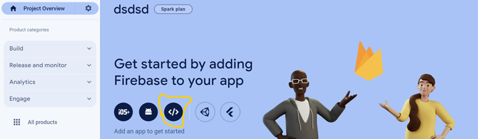
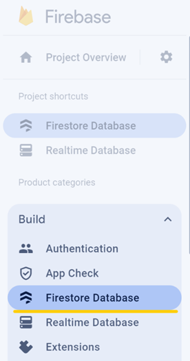
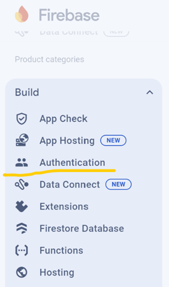
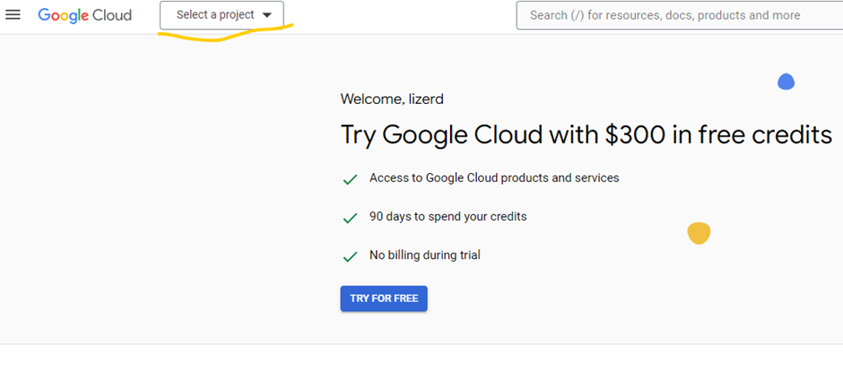
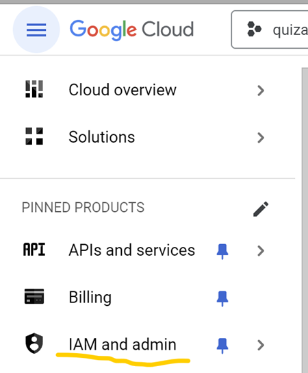
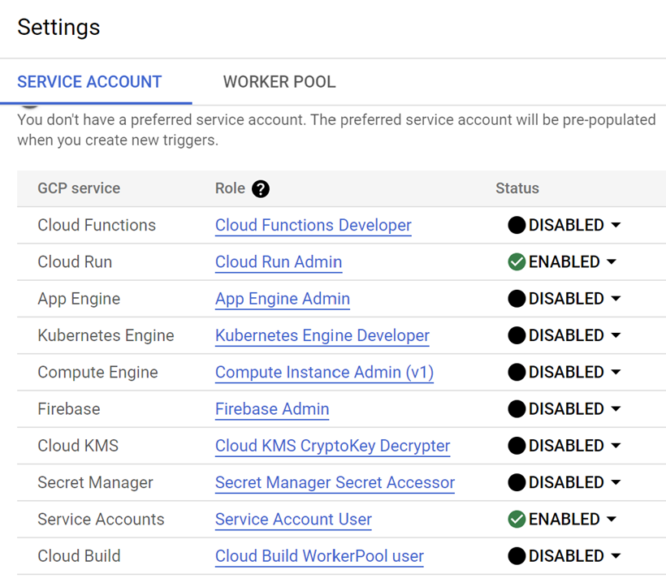
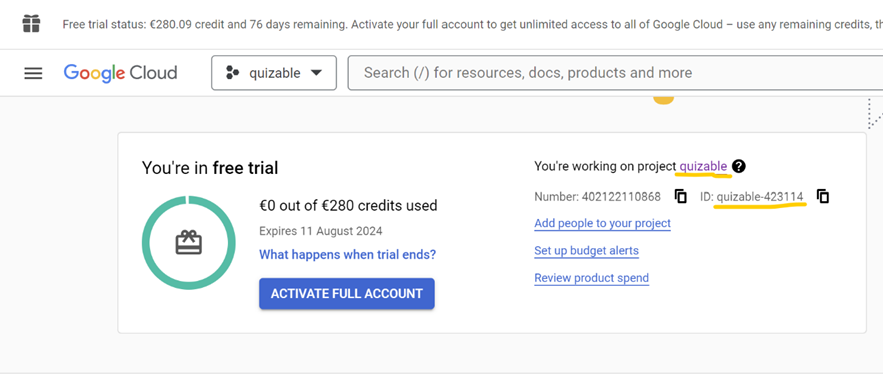

# Quizable 
 
 Quizable is an open-source and free-to-use web quiz app designed to enhance interactive learning and research, allowing users to create, customise and play quizzes in real-time. Once logged in using only your email address, you can create, edit, delete, and play quizzes from the overview screen. Quizzes can also be imported and exported in JSON format, enabling easy sharing between colleagues and friends. When selecting to play a quiz, players can join the quiz lobby without logging in by simply scanning the QR code displayed on the host’s screen and entering a nickname. During the quiz session, answer statistics are displayed after each question, and a leaderboard keeps track of scores. At the end of the quiz, a report can be sent to the host’s email for detailed analysis of responses from students or research participants. Quizable is seamless, simple, yet highly effective, making it the ideal tool for academic purposes.

 # How to Run and Deploy the App - Quizable

## Introduction
This is a short and minimalist documentation on how to run Quizable on your own machine.

## Prerequisites
Before you begin, make sure you have the following:

- **Google Account**: You need a Google account to sign in to Firebase.
- **Internet Connection**: Ensure you have a stable internet connection.
- **An IDE**: For example, Visual Studio Code. You need an IDE to run the app and to install all dependencies as well as deploying the project. [How to Install Visual Studio Code on Windows](https://www.geeksforgeeks.org/how-to-install-visual-studio-code-on-windows/)
- **Git**: You need git on your machine to pull the source code from GitHub. [Installing Git](https://git-scm.com/book/en/v2/Getting-Started-Installing-Git)
- **Node.js**: You need Node.js for installing all necessary dependencies required for the project. [How to Install Node.js](https://nodejs.org/en/learn/getting-started/how-to-install-nodejs)

## Step 1: Getting the Project from GitHub
1. **Open any prefered terminal** and navigate to your folder where you would like your project to be in. This can be done using the "cd" command on any machine. 
    > Tip: On **Windows**, You can navigate to any prefered folder and in the Path Input, type  `powershell` (overwriting the current path).  This will open up the terminal in the folder.
2. **Clone the Repository**: First, you need to clone the repository to your local machine. This is done using the `git clone` command followed by the repository's URL:
    ```bash
    git clone https://github.com/kkatharinaa/quizable.git
    ```
    If you encounter this error:
    ```
    git : the term 'git' is not recognized as the name of a cmdlet, function, script file, or operable program. check the spelling of the name, or if a path was included, verify that the path is correct and try again. at line:1 char:1
    ```
    then follow this tutorial to troubleshoot: [Troubleshooting Git Error](https://www.youtube.com/watch?v=h6xnrdn5sQc)

3. **Move to the Folder of the Main Project**: You need to move to the main folder of `quizable` as the whole project is located there, and installing all dependencies must be done there. To move to the folder of the main project, enter this command in the terminal:
    ```bash
    cd quizable
    ```

## Step 2: Access Firebase Console
1. **Open your web browser and go to the Firebase Console**.
2. **Sign in with your Google account credentials**.

## Step 3: Create and Set up a New Project In Firebase
1. **Create a new Firebase project**:
   Once you're signed in to your Firebase account, navigate to the dashboard. Look for the "Add project" button or select "Create a project". Click on it to begin the project creation process.

2. **Enter project details**:
   In the "Create a project" dialog, you'll see a field labelled "Project name." Enter a descriptive name for your project here. After entering the project name, click on the "Continue" button to proceed.

3. **Enable Google Analytics**:
   On the screen, you’ll have the option to enable Google Analytics for
 your project. Make sure to enable this option by checking “Enable Google Analytics for this project.”

4. **Create the project**:
   Once you've configured the project details and enabled Google Analytics, click on the "Create project" button to finalize the project setup.

5. **Configure Firebase for web**:
   After your project is created, Firebase will prompt you to set up your project for the web. Click on the "Web" option to proceed.

   

6. **Register your app**:
   In this step, you'll need to specify an app nickname for your web application. Enter a nickname in the provided field. Additionally, ensure that **"Also set up Firebase Hosting for this app"** is unchecked, as we'll focus on Firestore Database setup for now. Then click on **"Register app"**

7. **Skip the next few steps**:
   Skip the steps named "Add Firebase SDK", "Install CLI" and "Deploy to Firebase Hosting" by clicking **Next** and **Continue to console**. We will do these steps later on.

8. **View Firebase configuration**:
   Press on the Cog Wheel next to **Project Overview**>**Project settings** and scroll down the page to find the Firebase configuration details for your project. These include API keys and other credentials necessary for integrating Firebase with your application. Make sure to keep this information secure.

9. **Set up Firestore Database**:
   Now, let's configure Firestore Database. On the left sidebar of the Firebase console, locate the "Build" section. Under "Build," select "Firestore Database" to begin setting up your database.

   


10. **Create a new database**:
   Press the "Create database" button to start creating a new Firestore database for your project. You'll be prompted to choose a location for your database. Select your preferred location and click "Next" to proceed.

11. **Configure database security**:
    In the next window, you'll see options for setting up database security rules. For simplicity, toggle "Start in test mode" and click "Enable" to proceed.

12. **Create collection**:
    Now, create a collection to organize your data. Press "+ Start collection" to create a new collection.

13. **Create a document**:
    For Collection ID, give a name of “users”. For the Document ID, select "Auto-ID" to automatically generate a unique ID for each document. Add a field with any name and value to the document, then press "Save" to create the document.

14. **Turn On Authentication**:
    To add an Authentication method, navigate to the “Authentication” section and click on **Get started**. Then, head to the sign-in method and select “Email/Password”. Enable “Email/Password” and “Email link (passwordless sign-in)”. As a last step, click on “save” to add the Authentication method.

   


## Overall
By following these detailed instructions, you'll successfully set up the Firebase project, configure Firestore Database, and create necessary collections to organize the data effectively. If you encounter any errors or have questions along the way, don't hesitate to refer to the Firebase documentation.

# Step 4: Setting Up Firebase In Code

1. Open the app in Visual Studio Code:
To begin, launch Visual Studio Code on your computer. If you haven't already installed it, you can download it from the official website and follow the installation instructions for your operating system.

2. Install dependencies:
In Visual Studio Code, open the integrated terminal. This can be accessed by pressing `Ctrl + backtick ()`. Once the terminal is open, type the following command and press Enter: 
 ```bash
npm install
```
 This command will install all the necessary dependencies for your project. If you encounter an error related to a lack of permission, enter these commands in the VS Code terminal:
 ```bash
Set-ExecutionPolicy RemoteSigned -Scope CurrentUser
Get-ExecutionPolicy
```

3. Install Firebase tools globally:
In the same terminal, enter the following command and press Enter:
 ```bash
npm install -g firebase-tools
```

This command will install Firebase tools globally on your system, allowing you to use them from any directory.

4. Create a configuration file:
Within your project directory, create a file named `.env`. This file will store sensitive information like API keys and other credentials. The file should be located alongside `package.json`, so in the root of the entire project.

5. Add Firebase credentials to .env file:
Open the `.env` file in Visual Studio Code and add the following code, replacing the values with the actual credentials from your **Project Settings** tab of your project: (See Step 3 - N. 8)

 ```bash
VITE_API_KEY=<YOUR_API_KEY_FROM_FIREBASE>
VITE_AUTH_DOMAIN=<YOUR_AUTH_DOMAIN_FROM_FIREBASE>
VITE_PROJECT_ID=<YOUR_PROJECT_ID_FROM_FIREBASE>
VITE_STORAGE_BUCKET=<YOUR_STORAGE_BUCKET_FROM_FIREBASE>
VITE_MESSAGIN_SENDER_ID=<YOUR_MESSAGIN_SENDER_ID_FROM_FIREBASE>
VITE_APP_ID=<YOUR_APP_ID_FROM_FIREBASE>
EMAIL_SMTP="smtp.google.com"
EMAIL_PORT="587"
EMAIL_ADDRESS=<YOUR_OWN_EMAIL_ADRESS>
EMAIL_PASSWORD=<YOUR_OWN_EMAIL_PASSWORD>
```

6. Change value of "default" to your project id:
In `.firebaserc` file, change the value of the `default` field to match the name of your Firebase project. This value should be the same as the `VITE_PROJECT_ID` you entered earlier. This configuration ensures that the code knows which Firebase project to use from your Firebase account.

7. Execute a build script:
Now you need to prepare a command for creating a build of the frontend by using this command:
```bash
npm run build
```

8. Login to Firebase:
Now, log in to your Firebase account using the Firebase CLI. In the terminal, type:
```bash
firebase login
```

Follow the prompts to log in with your Firebase credentials. This step is necessary to deploy your project to Firebase. If you encounter errors, use the solution from step 2.


## Overall 
Following these steps carefully will ensure that your project is set up correctly. If you encounter any errors or have questions along the way, don't hesitate to refer to the Firebase documentation.

# Step 6: Deploy the app to Google Cloud

1. Set Up GCP Project: Navigate to the Google Cloud Platform (GCP) Console at <https://console.cloud.google.com/> Select "Create project" and provide a unique name for your project. Remember this name for future reference.

   

2. Enable Billing (Free Tier): In the GCP Console, navigate to "try for free" and click "Enable Billing."
Google will require you to verify your identity, but don't worry, you won't be charged unless you exceed the free tier limits.

3. Install Google Cloud SDK: The Google Cloud SDK is a command-line tool (gcloud) used to manage GCP resources.
 Follow the official installation guide provided for your operating system at <https://cloud.google.com/sdk/docs/install>

4. Link project to your GCP account: After installation Google cloud SDK, authenticate with GCP by running
    ```bash
    gcloud auth login
    ```
    in your terminal. This links your project to your GCP account.

5. Add Permissions to your project

    Go back to the Google Cloud page and navigate to “Navigate Menu” and select IAM and admin.

   

6. Select "Service Accounts" and then Click of “+ Create Service Account".

    In the first section called "Service account details", press on the reload button to the right of the "Service Account ID" to generate a new service account id. 

    Then click on **Create and Continue**.

    Then grant the following roles by clicking on "+ Add another role" and adding these roles: 
    
	+ “Owner”
	+ “Cloud run admin”
	+ “Service Account User”
	+ “Artifact Registry Writer”

    And then save the selected roles by clicking on done.

7. Enabling GCP services

    Now in the homepage enter “Cloud build” in the search bar, and in “Cloud build”, click on “Settings” and enable “Cloud run” and “Service Accounts”.

   

8. Enable Cloud Run Admin API

In the Google Cloud Console, Open the menu and select **API & Services**. Look for **Cloud Run Admin API**. Select it and click on the blue **Enable** Button. 

This will allow you to deploy the backend as a containerized app. 

8. Add Gcloud info to .env file

* In order to deploy this project to Google Cloud we need to input the values of:
	+ GCLOUD_PROJECT_NAME=<PROJECT_NAME_FROM_GCLOUD_DASHBOARD>
	+ GCLOUD_PROJECT_ID=<PROJECT_ID_FROM_GCLOUD_DASHBOARD>
	+ GCLOUD_PROJECT_REPO_NAME=quizapp-repo
	+ GCLOUD_PROJECT_REGION=europe-central2

   

9. Set Your Project ID

    Before deploying your project to Cloud Run, ensure you've set the correct Google Cloud project. You can do this using:
    ```bash
    gcloud config set project <your_project_id_from_gcloud>
    ```

    Replace `<your_project_id_here>` with the value of GCLOUD_PROJECT_ID from the environment file (.env) in the previous step. This command ensures that all subsequent commands will be executed within the context of your specified project.

10. Create docker image registry in the Artifact Registry 

    Before you deploy your project, you need to create a Docker Image Repository in the Artifact Registry. 

    For that, Navigate to the Google Cloud Console, Click on the Menu-Icon in the Top-Left and Select **Artifact Registry** (Alternatively, search for it in the top search bar)

    In the Artifact Registry Page, click on **+ Create Repository**. 

    Set these values in the create dialog page: 
    - Name: ****
    - Format: **Docker**
    - Mode: **Standard**
    - Location type: **Region**
    - Region: **europe-central2**

    Leave the rest of the properties untouched/unchange and clock on **Create**.

# Step 9: Deploy Your Project with Cloud Build

Deploy the backend using this command:

```bash
npm run deploy-backend
```

Copy the URL from the output of this command where it says **Service URL:** and add this value in the `.env`file.

```
VITE_API_URL=<SERVICE_URL_OF_NEWLY_DEPLOY_GCLOUD_PROJECT>
```

# Step 5: Deploy the web to Firebase

To deploy the app to firebase, just run the following command: 

```
npm run deploy-frontend
```

## Overall
By following this comprehensive guide, you've empowered yourself to deploy a project directly to Google Cloud Run using VS Code's terminal. Throughout the process, we covered essential tasks such as installing the Google Cloud CLI, authenticating with Google Cloud, setting up your Google Cloud project, and deploying your project to Cloud Run. These steps ensure a smooth deployment process and enable you to utilize the powerful features of Google Cloud Platform for the project.